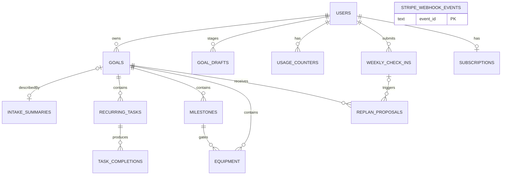

# Strix — Implementation Plan

## Context

Strix is a goal-tracking app where a user describes a big goal in plain language, an AI agent interviews them, and the system generates a structured plan of daily habits, weekly sessions, milestones, and equipment — with all active goals rolling up into a single Canvas-style "today" view. The MVP target is **mobile-first responsive web (PWA)** with a serious/documentary brand register (Patagonia, Arc'teryx, Uphill Athlete) — not the SaaS-bro cheerleader register.

The build is gated by §9 of the spec (a real user signs up → creates a goal → sees today clearly → checks off → does Friday check-in → accepts replan → installs to home screen feeling native) and §10 commerce constraints (tier-based active-goal caps, free-tier usage counters, click-to-cancel-compliant downgrade flow, Sonnet 4.6 across all tiers).

This file is the always-on entry point. Phase files in `./planning/` are loaded only when working on that phase.

The source spec is at `goal_tracker_spec.md`.

## 1. Architecture summary

| Layer | Choice | Why |
|---|---|---|
| Framework | **Next.js 15 App Router + TypeScript** | Best mobile-first responsive + PWA posture; server actions enforce free-tier counters server-side; streaming AI; mature Vercel pairing. |
| Database | **PostgreSQL on Neon** | Cheap, branchable, well-supported. |
| ORM | **Drizzle** | Type-safe schema, lightweight migrations, fits a TS-first codebase. |
| Auth | **Clerk** | Magic-link + Google + Apple out of the box; mobile-friendly UX; webhook syncs `users` row. |
| AI integration | **Server-routed Anthropic SDK** | Tier caps must be enforced server-side. Streaming for intake. **Sonnet 4.6** (`claude-sonnet-4-6`) for intake / plan-generation / replan **across all tiers** per §10. **Haiku 4.5** (`claude-haiku-4-5`) only for cheap classification — extracting structured `location_*` and `activity_type` from the intake transcript (the kind of "lightweight call no tier would notice" §10 explicitly permits). Anthropic prompt caching on the long system prompts. |
| Background jobs | **Inngest** | Auto-archive completed goals @7d; hard-delete account @30d; usage-counter reset cron; future v2 notification job. |
| Styling | **Tailwind + shadcn/ui (Radix primitives)** | Restrained primitives; we override defaults' cheerleader copy. CSS variables for the 5-color goal palette. |
| Billing | **Stripe** | Trial-with-card, monthly + annual, prorated annual refunds via API. Custom cancel — *not* Stripe Customer Portal — so the §10 downgrade-and-archive screen is the only barrier (see §5 flag #1). |
| Analytics | **PostHog (cloud)** | Server + client SDKs; event taxonomy from §9; doubles as feature-flag platform for §13.4 calibration. |
| Email | **Resend** | Transactional only: cancellation receipt, deletion confirmation. No retention emails per §10. |
| Hosting | **Vercel** | Pairs with Next.js; first-class preview deploys. Deploy topology frozen in ADR-0002. |

Prices from spec §10 live as Stripe Product/Price IDs + a `lib/billing/config.ts` map — never hardcoded in business logic.

## 2. Schema

Key columns (full DDL during Phase 0):

**All tables include `created_at` and `updated_at` timestamps via Drizzle's `timestamps()` helper** (omitted from column lists below for brevity). Used for cache invalidation, debugging, and PostHog correlation. `stripe_webhook_events` is the one intentional exception — it carries only `processed_at`.

- **users** — `id` (Clerk user_id, text PK), `email`, `display_name`, `timezone`, `intensity_preference` (enum: `comfortable|challenging|brutal`, nullable until intake sets it), `tier` (enum: `free|pro|max`), `stripe_customer_id`, `deleted_at` (`timestamp with time zone NULL`, soft-delete for 30-day grace), timestamps. **Index on `deleted_at` (partial WHERE deleted_at IS NOT NULL)** for the Phase 4 hard-delete cron.
- **subscriptions** — `user_id`, `stripe_subscription_id`, `tier` (`pro|max` by convention; the column reuses the shared `user_tier` enum, so the application — not the DB — keeps `'free'` out), `billing_period` (`monthly|annual`), `status`, `current_period_start/end`, `trial_start/end`, `cancel_at_period_end`, `canceled_at`, `pending_archive_goal_ids` (jsonb array, nullable — populated by trial-cancel selection screen; consumed at trial-end), `pending_archive_decided_at` (nullable), `trial_reminder_sent_at` (nullable timestamptz — idempotency marker for the `trialReminderTomorrow` Inngest job), **`superseded_at`** (nullable timestamptz — set when this subscription is being replaced in a tier transition (e.g. Max→Pro cancel+create); the `customer.subscription.deleted` handler skips tier/goal logic for superseded rows since the created/deleted webhook pair arrives in arbitrary order; cleared if the transition aborts). **Unique partial index `(user_id) WHERE status IN ('trialing','active')`** enforces "one active row per user." **`canceled_at` is write-once**: set when user completes the downgrade-and-archive screen; the `customer.subscription.deleted` webhook handler MUST NOT overwrite it. (The single exception is "Resume Max" before trial-end, which clears it back to NULL — covered in §5 flag #5.)
- **usage_counters** — `user_id`, `period_start`, `period_end`, `plan_generations_used`, `replans_used`. One row per user per calendar month (decision §3.5 below). **Unique constraint on `(user_id, period_start)`.** Inngest cron resets at user-local midnight on the 1st; lazy `ensureCurrentMonthCounter` is the source of truth.
- **goals** — `user_id`, `title`, `description`, `status` (`active|completed|archived`), `color_index` (0–4 → fixed palette), `intensity_override` (nullable; set only when the user explicitly diverges in goal detail — the effective-intensity chain is `intensity_override` → `intake_summaries.confirmed_intensity` → `users.intensity_preference`), `target_date`, `started_at` (set to `now()` on save), `completed_at`, `archived_at`, `auto_archive_at`, **`archive_reason`** (nullable enum: `user_action|trial_expired_no_action|downgrade_selection`), **`archive_notice_dismissed_at`** (nullable; gates the "we archived your goal" banner per Phase 3).
- **goal_drafts** — `id`, `user_id`, `session_token` (random opaque text, ~32 bytes base64url; mapped to an HttpOnly browser cookie — not a guessable timestamp), `seed` (text, nullable; whitelisted slug for empty-state tile), `raw_transcript` (jsonb, appended per intake message), `intake_summary_draft` (jsonb, populated when intake completes), `plan_draft` (jsonb, populated when plan-gen returns), `expires_at` (TTL: 30 days from `created_at` — accommodates a user who starts intake and returns the following week). Inngest job sweeps expired rows. **Used to stage intake transcripts and AI plan output before the user clicks "Save goal"** — at save, the relevant data is materialized into `goals` + `intake_summaries` + child tables in a single transaction, then the draft row is deleted. Index on `session_token` for cookie lookup.
- **intake_summaries** — `goal_id` (**nullable until "Save goal" is committed** — staging lives in `goal_drafts.intake_summary_draft`), `one_sentence_goal`, `starting_point` (text), `prior_experience` (free text — AI-described, not enum, per spec §8 "no experience-level segmentation"), `suggested_intensity` (enum: `comfortable|challenging|brutal` — AI's suggestion), `confirmed_intensity` (enum: `comfortable|challenging|brutal` — user's explicit pick at intake), `days_per_week`, `time_per_session_min`, `budget_usd`, **`location_city`**, **`location_region`**, **`location_country`**, **`activity_type`** (enum, see §3.6) + **`activity_type_other_label`** (text), `safety_flags` (jsonb `[{concern, alternative, user_overrode, decided_at}]`), `raw_transcript` (jsonb — preserved indefinitely for replan context; included in data export; hard-deleted on account deletion). **Location and activity_type are required even though they're not user-facing in MVP** — spec §7A + §12 V3 partner matching.
- **recurring_tasks** — `goal_id`, `title`, `cadence` (`daily|weekly`), `weekday` (0–6, weekly only), `estimated_duration_min`, `active` (bool — false after a replan removes it; preserves history for analytics).
- **task_completions** — `recurring_task_id`, `user_id`, `goal_id` (denormalized for dashboard query speed), `for_date` (the date the task was scheduled for), `completed_at` (timestamp). Unique on `(recurring_task_id, for_date)`. Index on `(user_id, for_date)`. **Server-side invariant at insert**: `goal_id` is derived from the recurring task's parent inside `scopedDb`'s single atomic `INSERT … SELECT` (a supplied value is validated in the same statement and rejected on mismatch) — the stored `goal_id` can never disagree with `rt.goal_id`, and a forged `recurring_task_id` inserts zero rows and throws (prevents forged-task-id DoS via the unique constraint).
- **milestones** — `goal_id`, `title`, `target_date`, `completed_at`, `position`.
- **equipment** — `goal_id`, `title`, `cost_usd` (nullable), `milestone_id` (nullable; when set, deadline derives from milestone), `standalone_deadline` (nullable; used only when not milestone-linked), `purchased_at`. Application-level invariant: exactly one of `milestone_id`/`standalone_deadline` is set.
- **weekly_check_ins** — `user_id`, `week_start_date`, `feeling` (`too_easy|right|too_hard|skipped` — `'skipped'` is written only by the check-in skip path; skips are not sentiment data and are excluded from every feeling-signal query), `notes`. User-level per spec §5; produces zero-or-more `replan_proposals` (one per active goal selected by user). **Unique constraint on `(user_id, week_start_date)`** — re-submission in the same week updates the existing row rather than creating a duplicate; updates fan out new `replan_proposals` for any newly-selected goals.
- **replan_proposals** — `goal_id`, `user_id` (denormalized from `goals.user_id` for soft-delete-filter join speed and PostHog event firing), `trigger` (`weekly_check_in|structural_edit`), `weekly_check_in_id` (nullable, since structural-edit replans have no parent check-in), `proposed_changes` (jsonb diff; Zod-typed in Phase 2 — `{ recurring_tasks: { add, modify, remove }, milestones: { add, modify, remove }, equipment: { add, modify, remove } }`), `status` (`pending|accepted|partially_accepted|rejected`), `decided_at`.
- **stripe_webhook_events** — `event_id` (text PK, Stripe-generated event ID), `type` (text, Stripe event type like `customer.subscription.deleted`), `processed_at` (timestamptz). **Idempotency log** — the Stripe webhook handler inserts a row before processing each event; on PK conflict it returns 200 immediately (the event was already handled). No `updated_at` — rows are append-only.

### FK ON DELETE behavior

| Parent → Child | Behavior |
|---|---|
| `users → goals` | RESTRICT (hard-delete cron purges children explicitly in order) |
| `users → goal_drafts` | CASCADE (drafts are ephemeral) |
| `users → usage_counters` | CASCADE |
| `users → weekly_check_ins` | RESTRICT (explicit purge) |
| `users → subscriptions` | RESTRICT (explicit purge) |
| `users → task_completions` | RESTRICT (explicit purge) |
| `goals → intake_summaries` | CASCADE |
| `goals → recurring_tasks` | CASCADE |
| `goals → milestones` | RESTRICT (equipment may reference; explicit purge in order) |
| `goals → equipment` | CASCADE |
| `goals → replan_proposals` | CASCADE |
| `recurring_tasks → task_completions` | RESTRICT (explicit purge) |
| `goals → task_completions.goal_id` | RESTRICT (denormalized FK; explicit purge) |
| `users → replan_proposals.user_id` | RESTRICT (denormalized FK; explicit purge) |
| `milestones → equipment.milestone_id` | SET NULL (equipment standalone_deadline backstop) |
| `weekly_check_ins → replan_proposals.weekly_check_in_id` | SET NULL (structural-edit replans persist) |

`RESTRICT` rows are purged explicitly in the Phase 4 hard-delete cron ordered to avoid FK violations.

Schema-level §10 notes:

- Tier-based feature gating reads `users.tier`. `mentor_enabled` is a derived predicate (`tier === 'max'`) not a separate column — v2 mentor ships as a one-line change.
- `subscriptions.canceled_at` is set when the user completes the downgrade-and-archive screen (not when they open it) — so that screen's primary button is the actual cancel. **Write-once: never overwritten by webhook handlers.**
- `subscriptions.pending_archive_goal_ids` + `pending_archive_decided_at` hold the trial-cancel deferred-execution selection (see §5 flag #5 below). Populated when a trialing user cancels; consumed by the trial-end Inngest job; cleared if the user resumes Max before trial-end.

## 3. §13 open product question decisions

1. **Pre-generate recurring completions nightly vs on-demand?** **DECIDED: on-demand.** Today's dashboard derives expected tasks from `recurring_tasks` + cadence + today's date, then checks `task_completions` for existence. No nightly cron needed for MVP. Streaks (v2) backfill expected-vs-actual from the same data.

2. **Missed daily task — silent skip or "incomplete forever"?** **DECIDED: silent skip.** Yesterday's incomplete daily disappears from today's view; completion history is what tells the replan AI "you did 3/7 days last week." Spec §9 quality bar #3 ("see their day clearly without scrolling past noise") and §11's prohibition on streak-style gamification both push against keeping red incomplete rows visible.

3. **Progress percentage formula?** **DECIDED: completed_milestones / total_milestones.** Shown as a simple bar on the goal card and goal-detail header. Weighted formulas are a v2 refinement; days-elapsed is a secondary contextual signal, not part of the percentage.

4. **How aggressively does intake ask follow-ups?** **DECIDED.** Target 4–6 user turns (1–2 questions per assistant turn), hard cap 10. Prompt biases toward fewer turns once all required structured fields are filled, deeper turns when safety-critical territory is detected. Wire PostHog `intake_turn_count` and `intake_drop_off_turn` events from day one to tune post-launch on real data. **No A/B test designed up front** — tune from telemetry.

5. **Usage-counter reset: calendar-1st or rolling 30-day?** **DECIDED: calendar-1st in user's timezone.** Simpler to message ("resets on the 1st"), simpler to operate, aligns with users' mental model of "monthly." Rolling is fairer in the abstract but the margin doesn't justify the operational complexity.

6. **Activity-type — fixed enum or free text?** **DECIDED: fixed enum + `other` with free-text qualifier.** Enum: `climbing, mountaineering, running, cycling, swimming, strength, language, writing, instrument, business, study, other`. When `other`, AI fills `activity_type_other_label`. Clean buckets for v3 partner matching; any `other` cluster that grows large becomes a candidate for promotion to a first-class enum value.

## 4. §14 decisions

| Item | Decision | Rationale |
|---|---|---|
| Framework / language | Next.js 15 App Router + TypeScript | See §1. |
| Database | PostgreSQL on Neon | Cheap, branchable, well-tooled. |
| ORM | Drizzle | Type-safe, lightweight, TS-first. |
| Auth | Clerk | Mature, mobile-friendly, magic-link + OAuth. |
| Styling | Tailwind + shadcn/ui + CSS vars for goal-color palette | Restrained primitives; we own the Patagonia-register copy. |
| Hosting | Vercel | Pairs with Next.js, preview deploys. |
| AI routing | Server-side only (route handlers / server actions) | Enforces tier caps, keeps API key secret. |
| Folder structure | Feature folders per route group: `app/(dashboard)/`, `app/(goals)/`, `app/(equipment)/`, `app/(check-in)/`, `app/(settings)/`; shared `lib/ai/{prompts,clients,streaming}.ts`, `lib/billing/`, `lib/db/` | Colocates concerns; avoids a `components/` graveyard. |
| Access scoping | Drizzle helper `scopedDb(userId)` that injects `user_id` on every read/write. No Postgres RLS in MVP. | RLS adds friction without much win when the same backend owns every query; the helper gives the same safety with simpler debugging. |
| Testing | Vitest (unit + component) + Playwright (one §9 golden-path E2E) | Mock Anthropic with recorded fixtures so AI flows are testable. |
| Deployment / envs | Vercel; region `iad1`; **one shared preview Neon DB** (a separate project from prod, migrated against the direct host — *not* branch-per-preview), production on the prod cutover. See ADR-0002. | Deploy contract frozen in ADR-0002. |
| Analytics platform | PostHog (cloud) | Doubles as feature-flag tool for §3.4 calibration. |
| Billing provider | Stripe | Trials with card, monthly + annual, refunds via API. |
| Email | Resend transactional only | No retention emails per spec §10. |
| Background jobs | Inngest | Auto-archive @7d; hard-delete @30d; usage-counter reset; future v2 notifications. |
| Visual design tokens | Dawn-atmospheric palette (deep indigo/dusk grounds + pale dawn neutrals + warm sun accents) with Fraunces/Hanken typography; chrome polarity + accent curated then minted once. CSS variables make swaps trivial. See docs/DESIGN.md (the DAWN system). | Spec §4 locks register, not tokens. |
| Goal-color palette | Fixed 5 dawn-derived hues; assigned at creation in first-unused order; reassignable manually; always paired with goal-name text. | Spec §8 visual attribution. |

## 5. Constraint flags + resolutions

1. **Stripe Customer Portal vs. custom cancel screen — RESOLVED: custom cancel.** Spec §10 mandates the downgrade-and-archive screen be the *only* barrier — click-to-cancel-compliant, no extra confirmation. Stripe Customer Portal adds its own confirmation UI. Skip Portal for cancel; route our settings "Cancel" button to a server action that opens our screen, then calls `stripe.subscriptions.update({cancel_at_period_end: true})` directly. Keep Portal available *only* for payment-method updates and invoice history. **Do not second-guess this during Phase 3.**

2. **§8 user-set intensity vs. per-goal calibration — RESOLVED: ship per-goal override as a *quiet* feature.** The goal-detail intensity control defaults to "Follows your intake intensity" with the goal's effective intensity (its intake `confirmed_intensity`) shown as the active selection. Users who don't override never see a divergence — the simple §8 mental model is preserved for casual users. Users who want goal-specific intensity (brutal for the marathon, comfortable for the novel) set it explicitly per goal. **The effective-intensity chain is three-tier: `goals.intensity_override` → `intake_summaries.confirmed_intensity` → `users.intensity_preference`** — replan prompts state this explicitly and all three branches are tested (the third is reachable only when a goal has no intake summary, since `confirmed_intensity` is NOT NULL). The actual justification for exposing it now is v3 partner matching: richer per-goal commitment data from day one.

3. **Patagonia-register copy across third-party defaults — RESOLVED: discrete Phase 5 copy pass.** Clerk's auth UI, Stripe Checkout's messaging, shadcn's toast/error copy all skew slightly cheerleader. Override copy at every customer-facing surface; budget a discrete copy pass in Phase 5 against spec §4. The brand voice is load-bearing, not decoration.

4. **§9 "feels native" PWA bar is non-trivial — RESOLVED: Phase 2.5 gates Phase 3.** Genuine home-screen-feels-native on iOS requires standalone display, splash, safe-area handling, no-bounce scroll containment, status-bar styling, and an offline shell for the dashboard. Treat PWA polish as a discrete phase; do not start commerce until install passes the measurable gate criteria in Phase 2.5 (zero browser-chrome after install on iPhone 15 Pro + Pixel 8, cold-launch < 2s, no URL-bar reveal on scroll, and the PWA installability gate (Phase 2.5 gate 4 — supersedes the retired Lighthouse PWA score)). Stranger test is a soft signal, not the formal gate.

5. **Trial-cancel timing — RESOLVED: decide at click, execute at trial-end.** SPEC §10:149 mandates that a user who cancels during the Max trial retains Max access until trial-end. Implementation: the downgrade-and-archive screen lets the user pick which goals to keep when their tier downgrades; selection is stored in `subscriptions.pending_archive_goal_ids` + `pending_archive_decided_at`; `stripe.subscriptions.update({ cancel_at_period_end: true })` fires immediately so Stripe stops billing at trial-end, but all goals stay `active` and Max-tier features stay enabled through the trial week. If the user resumes Max (un-cancels) before trial-end, the pending selection is cleared. At trial-end the Inngest function `applyPendingArchive` reads the pending selection and executes the archive — no new prompt. **Do not "simplify" this into archive-at-click (violates §10) or decide-at-expiry (ambushes the user).** Same flow applies to paid-tier cancellations where active_goals > target_tier_cap.

6. **Intensity at intake — RESOLVED: AI suggests, user explicitly confirms.** SPEC §8 (revised) requires the user to actively pick `comfortable|challenging|brutal` before plan generation. The AI proposes a starting intensity with reasoning based on goal + timeline, the user picks via a required prompt at the end of intake. `challenging` remains the **application-level** fallback only if intake completes without an explicit pick (degenerate case — should not happen via the normal flow; the schema column is NOT NULL with no default, so the fallback lives in the save path, not the DB). `users.intensity_preference` is nullable until the first goal's intake completes (after which it holds the user's most recent pick — its only runtime roles are the final fallback in the intensity chain and the default shown in Settings; it does not anchor future confirmation cards, which always pre-select the AI's per-goal suggestion). The pick is stored per-goal as `intake_summaries.confirmed_intensity`; `goals.intensity_override` stays NULL at creation and is written only when the user explicitly changes intensity in goal detail.

## 6. Phase index

| Phase | File | One-line description |
|---|---|---|
| 0 | [planning/phase-0-foundations.md](planning/phase-0-foundations.md) | Scaffold Next.js + Clerk + Neon + Drizzle, ship all migrations, wire PostHog SDK, build `scopedDb` access helper. |
| 1 | [planning/phase-1-golden-path.md](planning/phase-1-golden-path.md) | Empty-state dashboard → intake chat → plan generation → review/edit → today/this-week/upcoming view → check-off → goal detail → aggregated equipment. |
| 2 | [planning/phase-2-close-the-loop.md](planning/phase-2-close-the-loop.md) | Weekly check-in, replan diff UI, goal completion + Inngest auto-archive @7d, Accomplished section. |
| 2.5 | [planning/phase-2.5-pwa-polish.md](planning/phase-2.5-pwa-polish.md) | Manifest, service worker, offline dashboard shell, iOS standalone/splash/safe-area, install affordance — **GATES PHASE 3**. |
| 3 | [planning/phase-3-commerce.md](planning/phase-3-commerce.md) | Stripe products, Max-only trial-with-card, free-tier caps + upgrade prompts, downgrade-and-archive screen, custom cancel via API, annual prorated refund. |
| 4 | [planning/phase-4-privacy.md](planning/phase-4-privacy.md) | Settings, JSON data export, account deletion with 30-day soft delete + Stripe customer cleanup, Resend transactional emails. |
| 5 | [planning/phase-5-polish.md](planning/phase-5-polish.md) | Full PostHog event taxonomy, Patagonia-register copy pass across third-party surfaces, accessibility audit, Playwright golden-path E2E. |

Each phase file is self-contained: items to build, verification criteria for that phase, and phase-specific context (prompts, schema notes, edge cases). Phases must land in order; Phase 2.5 strictly gates Phase 3.

**Shipped:** Phase 0 closed 2026-06-10 (see [planning/phase-0-foundations.md](planning/phase-0-foundations.md) status header). Design-infrastructure work package (issue #1, PR #2) shipped 2026-06-10 as **v0.2.0**: the DAWN design system is frozen ([docs/DESIGN.md](docs/DESIGN.md)), the `verify:ui` axe + screenshot CI gate is live, and motion primitives landed — Phase 1 UI builds on it (see the Design-system handoff in [planning/phase-1-golden-path.md](planning/phase-1-golden-path.md)).

**Deploy reframing (ADR-0002):** **v0.5.0 certifies native-feel on a `*.vercel.app` PREVIEW** (Clerk **dev** instance) — it is **not** a production deploy and stands up no custom domain. The **production** standup (custom domain + Clerk **prod** instance + prod Neon + prod PostHog + Stripe) is the **Phase-3 prod cutover**, gated by the Phase-3 commerce exit gate ([LAUNCH_CHECKLIST.md](LAUNCH_CHECKLIST.md), issue #70). The frozen deploy contract — Vercel/`iad1`, one shared preview Neon DB, embedded Clerk auth, and the full env surface — lives in [ADR-0002](docs/adr/0002-production-deploy.md).
